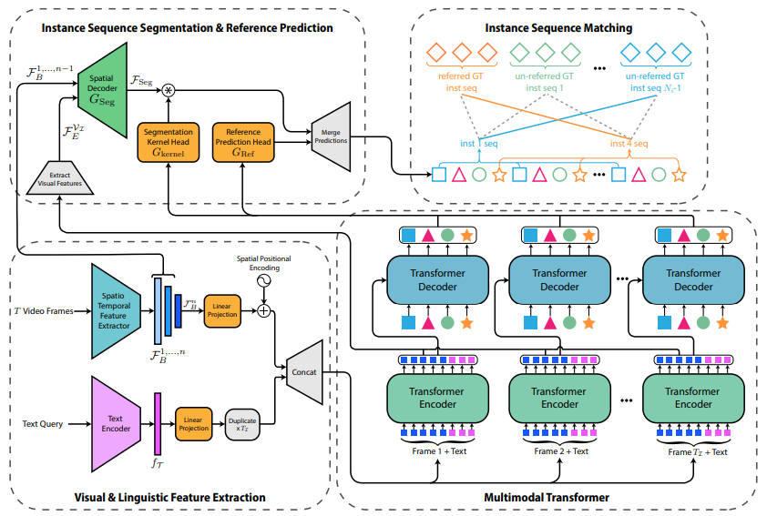
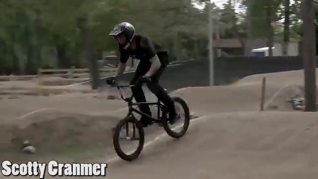
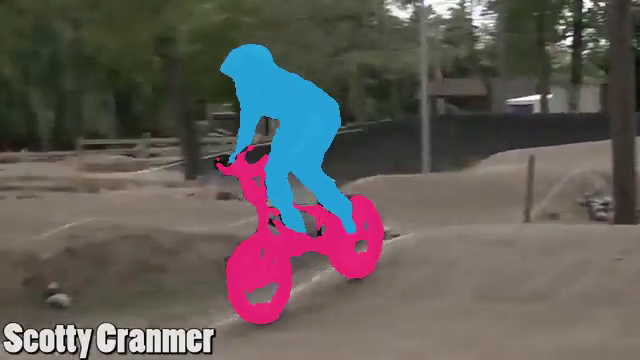
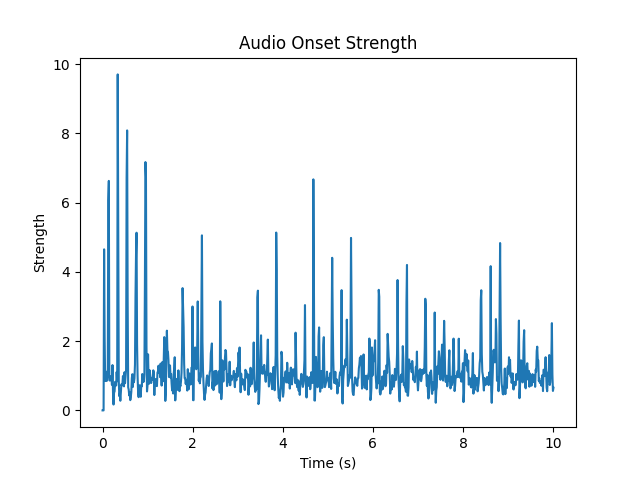
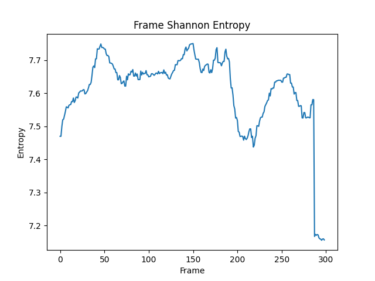
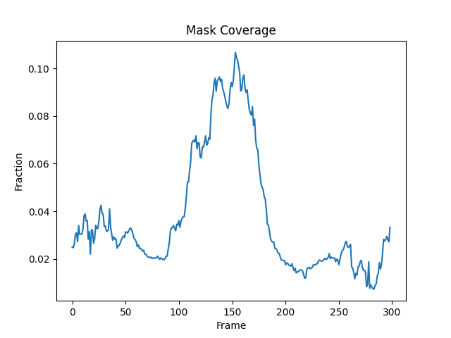
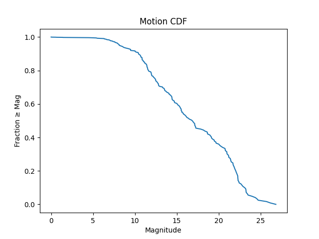
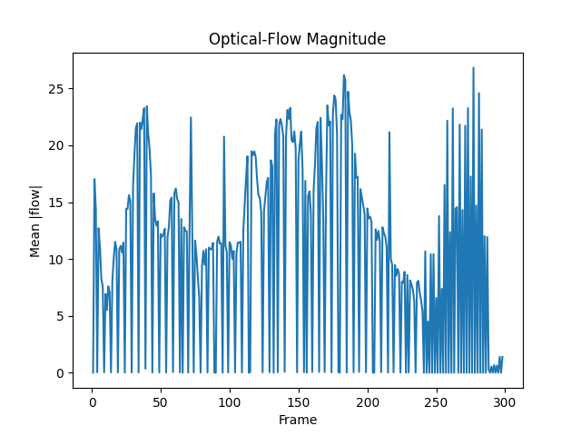
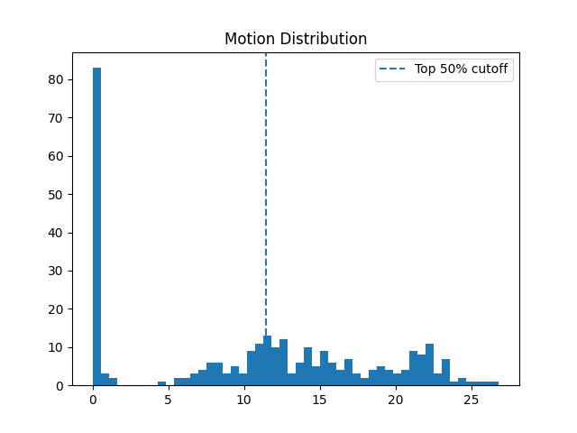
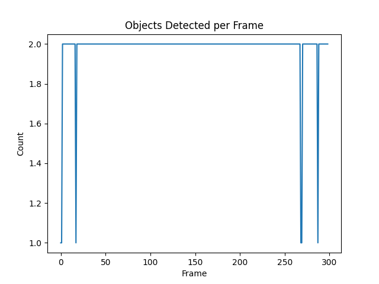

# Real-time Referred Video Object Segmentation (RVOS)-based Video Summarization

This project, "Real-time Referred Video Object Segmentation (RVOS)-based Video Summarization using Multimodal Transformers," aims to produce short, abstracted summaries of lengthy videos by capturing the most salient information relevant to a user's query. It leverages the **Multimodal Tracking Transformer (MTTR)** for RVOS, allowing users to specify objects of interest via natural language. The system then generates a summary based on the segmented frames.

## Project Overview

*   **Main Script**: `rvos_summarizer.py` (renamed from `summary2.py`)
*   **Goal**: To create short, relevant video summaries guided by natural language queries.
*   **Core Technology**: Employs Referring Video Object Segmentation (RVOS) using the Multimodal Tracking Transformer (MTTR) [1].
*   **GPU Used (during development)**: NVIDIA A100-SXM4-40GB
*   **Reference Materials**:
    *   [1] [End-to-End Referring Video Object Segmentation with Multimodal Transformers (CVPR 2022)](https://arxiv.org/abs/2111.14821)
    *   `rvos5.pdf` (Detailed Project Report)
    *   `EE673_Presentation.pdf` (Project Presentation)

The core methodology involves a two-stage pipeline:
1.  **Referring Video Object Segmentation (RVOS):** Utilizes a pre-trained MTTR model to segment and track objects mentioned in a natural language query throughout the input video.
2.  **Video Summarization:** Processes the segmented frames to create a concise summary. Two approaches are implemented:
    *   **Uniform Temporal Sampling:** A baseline method that samples frames at regular intervals.
    *   **Feature-based Analysis:** A more advanced method that analyzes various content features (e.g., motion, scene changes, object prominence, audio events) to guide the summarization and generate analytical plots.

## Key System Components & Workflow

The development involved several key stages:
*   **MTTR Model Setup:** Integration of the pre-trained Multimodal Tracking Transformer.
*   **Video Processing Pipeline:** Automated handling of input videos (e.g., downloading from YouTube, trimming to desired lengths) using tools like `yt_dlp` and `MoviePy`.
*   **RVOS Inference:** Performing inference with the MTTR model to obtain segmentation masks for the queried object in each frame of the video.
*   **Summarization Modules:**
    *   *Uniform Sampler:* For basic temporal summarization based on a user-specified percentage.
    *   *Feature-based Analyzer:* For content-aware analysis, producing various metrics and plots. This module also provides the foundation for more advanced keyframe selection for summarization.
*   **Integration & Output:** An end-to-end system that takes a video (URL or local file) and a text query, outputting an annotated video showing the segmented object, a summary video clip (via uniform sampling or potentially feature-based selection in future iterations), and a collection of analytical feature plots.

The overall system flow is:
`Input Video + Text Query` → `MTTR (RVOS Segmentation)` → `Annotated Video (Frames + Masks)`

Then, the `Annotated Video` can be processed by:
1.  `Uniform Sampling Summarizer` → `Sampled Summary Clip`
2.  `Feature-based Analyzer` → `Analytical Plots` (and potentially a `Content-Aware Summary Clip` in future extensions based on these features)

### MTTR Architecture
The MTTR architecture processes visual (video frames) and textual (language query) information jointly. It uses separate encoders for visual and textual features, which are then fused and processed by a multimodal Transformer encoder-decoder structure. This allows the model to understand object, text, and temporal sequence relationships to predict instance sequences (segmentation masks over time) for entities in the video, with a specific prediction head determining which sequence corresponds to the text query.

<p align="center">
  
</p>

## Key Highlights
*   **Query-Driven Summarization:** Generates video summaries tailored to user-specified objects or actions, moving beyond generic summaries.
*   **State-of-the-Art RVOS:** Employs the powerful MTTR model for accurate object segmentation and tracking in videos.
*   **Dual Summarization Strategies:** Offers both a simple uniform sampling method for quick temporal compression and a sophisticated feature-based analysis approach for deeper content understanding.
*   **Rich Video Analysis:** The feature-based analyzer provides detailed plots of various video characteristics (motion, scene changes, object prominence, etc.), aiding in content understanding and forming a basis for intelligent summarization.

## Demonstration & Qualitative Results
The underlying MTTR model demonstrates strong performance on standard RVOS benchmarks like A2D-Sentences. Our system successfully applies this for query-based summarization. Below is an example showcasing an input video frame and the corresponding output frame generated by our RVOS system after processing with the query "a guy riding a bike." The segmented object is clearly distinguished with a colored mask.

<p align="center">
  
  
</p>

## Feature Analysis & Visualizations
The Feature-based Analyzer computes several metrics from the video content post-RVOS, providing insights into video dynamics and the behavior of the referred object. These metrics, visualized as plots, include:

*   **Audio Onset Strength / Envelope:** Detects significant audio events from the soundtrack.
    <p align="center"></p>
*   **Frame Shannon Entropy:** Measures the visual complexity or information content per frame.
    <p align="center"></p>
*   **Mask Coverage:** Represents the ratio of the frame area covered by the segmented object, indicating object prominence or scale.
    <p align="center"></p>
*   **Motion Cumulative Distribution Function (CDF):** Shows the distribution of motion magnitudes across the video.
    <p align="center"></p>
*   **Mean Optical Flow Magnitude per Frame:** Quantifies the average motion in each frame.
    <p align="center"></p>
*   **Motion Histogram:** Displays the histogram of motion magnitudes.
    <p align="center"></p>
*   **Object Count / Scene Change Score (example):** (The `object_count.png` might represent scene change scores or another specific metric from your implementation. The paper mentions "Scene Change Scores (Detecting cuts/shifts)" as a feature).
    <p align="center"></p>

## Getting Started

### Prerequisites

*   Python 3.9.7
*   PyTorch 1.10.0
*   CUDA Toolkit (compatible with your NVIDIA GPU, e.g., for NVIDIA A100-SXM4-40GB)

### Installation

1.  **Clone the Repository**:
    ```bash
    git clone https://github.com/shashwat39/rvos-summarizer.git
    cd rvos-summarizer
    ```

2.  **Create and Activate Conda Environment**:
    ```bash
    conda create -n rvos_env python=3.9.7 pip -y
    conda activate rvos_env
    ```

3.  **Install Dependencies**:
    ```bash
    # Install PyTorch with CUDA support
    conda install pytorch==1.10.0 torchvision==0.11.1 torchaudio==0.10.0 cudatoolkit=X.X -c pytorch -c conda-forge
    # Replace X.X with your CUDA version, e.g., 11.3
    # If you don't have a GPU or want CPU version:
    # conda install pytorch==1.10.0 torchvision==0.11.1 torchaudio==0.10.0 cpuonly -c pytorch

    pip install transformers==4.11.3
    pip install h5py wandb opencv-python protobuf av einops ruamel.yaml timm joblib yt-dlp moviepy
    conda install -c conda-forge pandas matplotlib cython scipy
    # For GPU-accelerated libraries if needed and compatible (e.g., cupy)
    # conda install -c conda-forge cupy # Ensure CUDA toolkit is set up
    ```

## Usage

To run the RVOS summarizer on a video clip:

```bash
python rvos_summarizer.py --input_video_path path/to/your/input_clip.mp4 --query "Your natural language query here" --output_video_path path/to/your/output_clip.mp4 --output_summary_path path/to/your/summary_clip.mp4 --output_frames_dir path/to/save/frames/ --output_plots_dir path/to/save/plots/
```
- --input_video_path: Path to the input video file or a YouTube URL.
- --query: The natural language description of the object/action to segment and summarize.
- --output_video_path: Path to save the full annotated video (with segmentation masks).
- --output_summary_path: Path to save the summarized video clip (using uniform sampling).
- --output_frames_dir: Directory to save individual annotated frames.
- --output_plots_dir: Directory to save the analytical feature plots.

Example-
```bash
python rvos_summarizer.py --input_video_path "https://www.youtube.com/watch?v=dQw4w9WgXcQ" --query "a man singing and dancing" --output_video_path ./output/annotated_video.mp4 --output_summary_path ./output/summary.mp4 --output_frames_dir ./output/frames/ --output_plots_dir ./output/plots/
```

Refer to python rvos_summarizer.py --help for all available options.
Future Work
Potential areas for future development and research include:
- **Smarter Keyframe Selection:** Developing more sophisticated algorithms that leverage the extracted features from the Feature-based Analyzer for optimal summary frame selection, creating more semantically relevant summaries.
- **Efficiency Improvements:** Optimizing the processing pipeline, potentially exploring model distillation for MTTR or other techniques, to aim for faster processing and near real-time capabilities.
- **User Studies:** Conducting comprehensive user studies to evaluate the perceptual quality, relevance, and overall usefulness of the generated summaries from an end-user perspective.
- **Exploring Different RVOS Models:** Testing and integrating newer or alternative state-of-the-art RVOS architectures as they emerge in the research community.
- **Broader Applications:** Investigating the use of this RVOS-based summarization framework in other related areas such as semantic video search, content moderation, or video understanding tasks.
